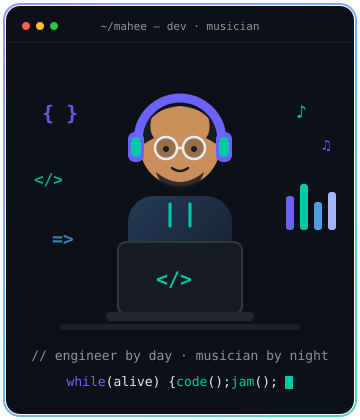

<!-- ═══════════════════════ HEADER ═══════════════════════ -->
<div align="center">
  

  <!-- rotating prompt tagline -->
  

  <br/>

  <!-- terminal-path badges -->
  <a href="https://jahidun-nur-mahee.vercel.app">
    
  </a>
  <a href="https://www.linkedin.com/in/differentmahee13/">
    
  </a>
  <a href="https://github.com/maheenur13?tab=followers">
    
  </a>
  

</div>

<br/>

<!-- ═══════════════════════ ABOUT ME ═══════════════════════ -->
## 💻 `$ whoami`



```typescript
// mahee.service.ts — running since 2021, zero downtime ☕

@Injectable({ scope: Scope.DEFAULT }) // always available
export class Mahee extends SoftwareEngineer implements Musician {
  readonly company = "Strativ AB 🇸🇪";
  readonly startup = "Ternion Loop — Founder & CEO 🚀";
  readonly firstProduct = "Sports Loop 🏟️";
  readonly base = "Dhaka, Bangladesh 🇧🇩";
  readonly uptime = "4+ years in production";
  readonly motto = "I code everyday! ^_^";

  async currentFocus(): Promise<Focus[]> {
    return ["AI & LLM apps 🤖", "RAG pipelines", "Microservices", "DevOps"];
  }

  @Get("/stack")
  stack(): TechStack {
    return {
      frontend: ["TypeScript", "React", "Next.js"],
      backend: ["Node.js", "NestJS", "PostgreSQL", "Redis"],
      mobile: ["React Native", "Expo"],
    };
  }

  @Cron("*/60 * * * *") // hourly, non-negotiable
  refuel(): Coffee { return new Coffee({ size: "large" }); }

  @OnEvent("work.done")
  unwind(): Music {
    return this.play("guitar 🎸") ?? this.produce("FL Studio 🎹");
  }
}
```

```console
$ mahee --achievements
  🏆 3rd place — Inter-University Programming Competition
  🧩 260+ problems solved on LeetCode & Beecrowd
  🌐 portfolio → https://jahidun-nur-mahee.vercel.app
```

<br clear="right"/>

<!-- ═══════════════════════ EXPERIENCE ═══════════════════════ -->
## 💼 `$ git log --career`

```console
$ git log --career --oneline --graph

* e7d19f3 (feature/startup) Founder & CEO · Ternion Loop 🚀
│          shipping Sports Loop 🏟️ — our first product
│
* a4f2b1c (HEAD -> main, origin/stockholm) Software Engineer · Strativ AB 🇸🇪
│          Aug 2024 → present · scalable web apps · code reviews · mentoring
│
* 9c8e3d2 (dhaka) Software Engineer · APSIS Solutions Ltd 🇧🇩
│          Jun 2022 → Jul 2024 · full-stack apps · microservices · performance
│
* 1f0a7e5 (dhaka) Junior Software Engineer · Zaynax Ltd 🇧🇩
           Aug 2021 → Jun 2022 · responsive web apps · REST APIs · agile

$ # 4+ years committed, zero force-pushes to production 😌
```

<!-- ═══════════════════════ TECH STACK ═══════════════════════ -->
## 🛠️ `$ npx mahee --stack`

<div align="center">

### `~/frontend`


<sub>+ Ant Design • Redux Toolkit • Zustand • Recoil • TanStack Query • Socket.io</sub>

### `~/backend`


<sub>+ Microservices • Zod • REST APIs • Authentication & Authorization</sub>

### `~/ai-llm` 🤖
    

<sub>LLM-powered apps • chatbots • tool calling • content engines • document extraction</sub>

### `~/databases`


<sub>+ Mongoose • SQL</sub>

### `~/mobile-desktop`


<sub>React Native • Expo • iOS Development • Electron.js</sub>

### `~/devops-tools`


<sub>+ Railway • Cursor • Husky • Prettier • ESLint • Jira • ClickUp • cPanel</sub>

</div>

<!-- ═══════════════════════ FEATURED PROJECTS ═══════════════════════ -->
## 🚀 `$ ls ~/projects --featured`

| Project | Description | Tech |
|---------|-------------|------|
| 🏟️ **Sports Loop** | Ternion Loop's first product — as Founder & CEO 🚀 | TypeScript |
| ⚙️ **Alent Dynamic** | Industrial IoT system for real-time monitoring & control of manufacturing processes | React.js • Node.js • MQTT • PostgreSQL • Redis |
| 🧠 **Content Engine (RAG)** | Retrieval-Augmented Generation pipeline for AI-powered content generation & semantic search | TypeScript • LLMs • Embeddings • Vector DB |
| 🤖 **[AI Invoice Extractor](https://github.com/maheenur13/ai-invoice-extractor)** | LLM-powered invoice data extraction | TypeScript |
| 💬 **[LLM Chatbot](https://github.com/maheenur13/llm-chatbot)** | Full-stack AI chatbot ([backend](https://github.com/maheenur13/chatbot-backend)) | TypeScript |
| 📄 **[Resume Builder](https://github.com/maheenur13/resume-builder)** | Modern resume building tool | TypeScript |

<!-- ═══════════════════════ GITHUB STATS ═══════════════════════ -->
## 📊 `$ git stats --all-time`

<div align="center">

  
  

  <br/><br/>

  

  <br/><br/>

  

</div>

<!-- ═══════════════════════ TROPHIES ═══════════════════════ -->
## 🏆 `$ gh trophies --unlock-all`

<div align="center">
  
</div>

<!-- ═══════════════════════ SNAKE ═══════════════════════ -->
## 🐍 `$ ./snake --eat contributions`

<div align="center">
  <picture>
    <source media="(prefers-color-scheme: dark)" srcset="https://raw.githubusercontent.com/maheenur13/maheenur13/output/github-contribution-grid-snake-dark.svg"/>
    <source media="(prefers-color-scheme: light)" srcset="https://raw.githubusercontent.com/maheenur13/maheenur13/output/github-contribution-grid-snake.svg"/>
    
  </picture>
</div>

<!-- ═══════════════════════ QUOTE ═══════════════════════ -->
## ✍️ `$ fortune --dev`

<div align="center">
  
</div>

<!-- ═══════════════════════ FOOTER ═══════════════════════ -->
<div align="center">

  ### 🤝 `$ mahee --connect`

  <sub>establishing connection… let's build something great together</sub>
  <br/><br/>

  <a href="https://jahidun-nur-mahee.vercel.app">
    
  </a>
  <a href="https://www.linkedin.com/in/differentmahee13/">
    
  </a>

  <br/>

  
</div>
